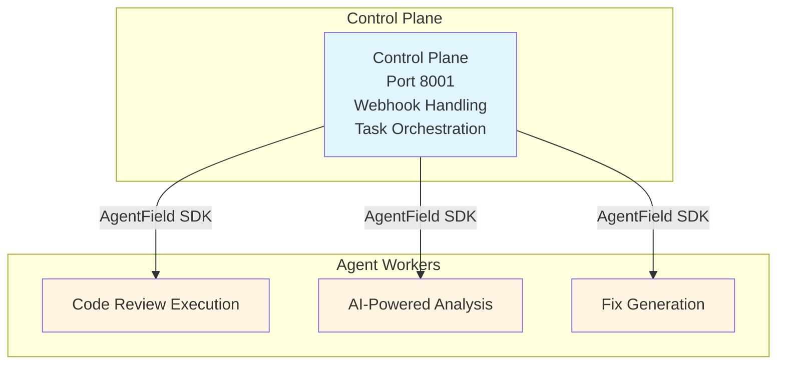
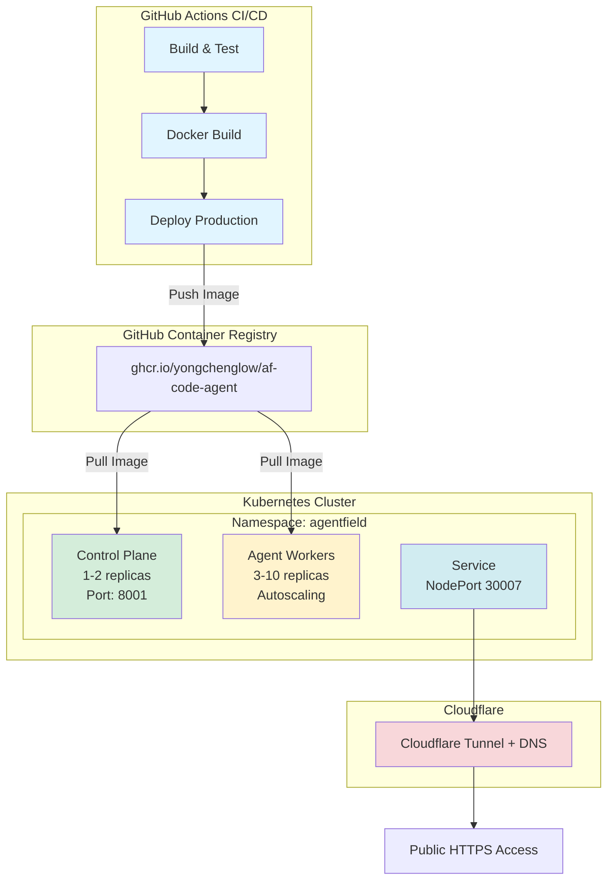

# Deployment Guide

This guide explains how to deploy the GitHub Code Review Agent to Kubernetes using Helm.

## Table of Contents

- [Overview](#overview)
- [Prerequisites](#prerequisites)
- [GitHub Secrets Configuration](#github-secrets-configuration)
- [Helm Charts](#helm-charts)
- [Deployment Process](#deployment-process)
- [Verification](#verification)
- [Troubleshooting](#troubleshooting)

## Overview

The deployment uses a distributed architecture powered by AgentField:

- **Namespace**: `agentfield`
- **Control Plane**: 1-2 replicas, handles webhooks and orchestration
- **Agent Workers**: 3-10 replicas with autoscaling, executes code reviews
- **Production URL**: https://agentfield.yongchenglow.com

### Architecture



## Prerequisites

1. Kubernetes cluster with kubectl access
2. Helm 3.13.0 or later
3. GitHub Container Registry (GHCR) access
4. Cloudflare account with:
   - Tunnel configured
   - DNS zone
   - API token with DNS and Tunnel edit permissions

## GitHub Secrets Configuration

Configure the following secrets in your GitHub repository settings (**Settings → Secrets and variables → Actions**):

### Required Secrets

| Secret Name                | Description                                      | How to Obtain                                    |
| -------------------------- | ------------------------------------------------ | ------------------------------------------------ |
| `KUBECONFIG_PROD`          | Base64-encoded kubeconfig for production cluster | `cat ~/.kube/config \| base64 \| pbcopy`         |
| `CLOUDFLARE_API_TOKEN`     | Cloudflare API token with DNS & Tunnel permissions | Cloudflare Dashboard → API Tokens               |
| `CLOUDFLARE_ACCOUNT_ID`    | Your Cloudflare account ID                       | Cloudflare Dashboard                             |
| `CLOUDFLARE_TUNNEL_ID`     | Your Cloudflare tunnel ID                        | Cloudflare Zero Trust → Access → Tunnels         |

### Container Registry Secret

Before deploying, create a secret for pulling images from GitHub Container Registry:

```bash
kubectl create secret docker-registry ghcr-secret \
  --docker-server=ghcr.io \
  --docker-username=YOUR_GITHUB_USERNAME \
  --docker-password=YOUR_GITHUB_PAT \
  --docker-email=YOUR_EMAIL \
  -n default
```

The deployment workflow will copy this secret to the `agentfield` namespace.

## Helm Charts

### Chart Structure

```
helm/agentfield/
├── Chart.yaml                    # Chart metadata
├── values.yaml                   # Default values
├── values-production.yaml        # Production overrides
└── templates/
    ├── deployment.yaml          # Control plane deployment
    ├── agent-deployment.yaml    # Agent worker deployment
    ├── service.yaml             # Control plane service
    ├── serviceaccount.yaml      # ServiceAccount manifest
    ├── configmap.yaml           # ConfigMap manifest
    └── hpa.yaml                 # HorizontalPodAutoscaler
```

### Configuration

#### Production Settings (`values-production.yaml`)

**Control Plane:**

- 1 replica (autoscales to 2)
- 500m CPU / 512Mi memory (requests)
- 1 CPU / 1Gi memory (limits)
- NodePort: 30007
- Host: agentfield.yongchenglow.com

**Agent Workers:**

- 3 replicas (autoscales to 10)
- 1 CPU / 1Gi memory (requests)
- 2 CPU / 2Gi memory (limits)
- Autoscaling: 70% CPU / 75% memory threshold

### Secrets Management

**CRITICAL**: Create the `agentfield-secrets` secret BEFORE deploying:

```bash
cd helm/agentfield

# Option 1: Create from .env file
kubectl create secret generic agentfield-secrets \
  --from-env-file=../../.env \
  -n agentfield

# Option 2: Create from template
cp secret-example.yaml secret.yaml
# Edit secret.yaml with your values
kubectl apply -f secret.yaml
rm secret.yaml  # Clean up!
```

**Required Secret Keys:**

- `AGENTFIELD_URL`
- `GITHUB_APP_ID`
- `GITHUB_PRIVATE_KEY`
- `GITHUB_WEBHOOK_SECRET`
- `OPENAI_API_KEY`
- `AI_BASE_URL`
- `AI_MODEL`
- `LOG_LEVEL`
- `PORT`

See `helm/agentfield/secret-example.yaml` for the complete template.

## Deployment Process

### Automatic Deployment (Recommended)

Push to the `main` branch to trigger automatic deployment:

```bash
git checkout main
git add .
git commit -m "Your changes"
git push origin main
```

GitHub Actions will:

1. Build and test the code
2. Create multi-arch Docker image
3. Push to GitHub Container Registry
4. Deploy to Kubernetes using Helm
5. Configure Cloudflare DNS and Tunnel

### Manual Deployment

#### Using Helm

```bash
export IMAGE_TAG="main-abc123def456"

helm upgrade --install agentfield-control-plane ./helm/agentfield \
  -n agentfield \
  --create-namespace \
  -f ./helm/agentfield/values-production.yaml \
  --set controlPlane.image.tag=$IMAGE_TAG \
  --wait
```

#### Using kubectl

```bash
# Create namespace
kubectl create namespace agentfield

# Create secrets
kubectl create secret generic agentfield-secrets \
  --from-literal=GITHUB_APP_ID=123456 \
  --from-literal=GITHUB_PRIVATE_KEY="-----BEGIN..." \
  --from-literal=GITHUB_WEBHOOK_SECRET=your-secret \
  --from-literal=OPENAI_API_KEY=sk-your-key \
  -n agentfield

# Deploy with Helm
helm install agentfield-control-plane ./helm/agentfield \
  --namespace agentfield \
  -f ./helm/agentfield/values-production.yaml
```

## Verification

### Check Deployment Status

```bash
# Check all pods
kubectl get pods -n agentfield

# Check control plane
kubectl get pods -l app.kubernetes.io/component=control-plane -n agentfield

# Check agent workers
kubectl get pods -l app.kubernetes.io/component=agent -n agentfield

# Check services
kubectl get svc -n agentfield

# Check HPA status
kubectl get hpa -n agentfield
```

### View Logs

```bash
# Control plane logs
kubectl logs -f deployment/agentfield-control-plane -n agentfield

# Agent worker logs
kubectl logs -f deployment/agentfield-agent -n agentfield

# Last 100 lines
kubectl logs --tail=100 deployment/agentfield-control-plane -n agentfield
```

### Test Webhook Endpoint

```bash
# Port forward
kubectl port-forward svc/agentfield-control-plane 8001:8001 -n agentfield

# Test in another terminal
curl -X POST http://localhost:8001/webhook
```

### Verify Cloudflare Integration

After deployment, verify:

1. DNS record exists: `agentfield.yongchenglow.com`
2. Tunnel is routing traffic
3. HTTPS is working: `curl https://agentfield.yongchenglow.com/health`

## Troubleshooting

### Pods Not Starting

```bash
# Describe pod for events
kubectl describe pod -l app.kubernetes.io/name=agentfield -n agentfield

# Check logs
kubectl logs -l app.kubernetes.io/name=agentfield -n agentfield
```

### Image Pull Errors

```bash
# Verify secret exists
kubectl get secret ghcr-secret -n agentfield

# If missing, copy from default namespace
kubectl get secret ghcr-secret -n default -o yaml | \
  sed 's/namespace: default/namespace: agentfield/' | \
  kubectl apply -f -
```

### Pod Crashes or CrashLoopBackOff

```bash
# Check pod logs
kubectl logs -f deployment/agentfield-control-plane -n agentfield

# Check resource usage
kubectl top pods -n agentfield

# Describe pod for events
kubectl describe pod -l app.kubernetes.io/name=agentfield -n agentfield
```

### Cloudflare Issues

1. Verify API token has correct permissions:
   - Zone:DNS:Edit
   - Account:Cloudflare Tunnel:Edit

2. Check tunnel is running:
   ```bash
   cloudflared tunnel info YOUR_TUNNEL_ID
   ```

3. Verify DNS records in Cloudflare dashboard

### Rollback Deployment

```bash
# View rollout history
kubectl rollout history deployment/agentfield-control-plane -n agentfield

# Rollback to previous version
kubectl rollout undo deployment/agentfield-control-plane -n agentfield

# Rollback to specific revision
kubectl rollout undo deployment/agentfield-control-plane --to-revision=2 -n agentfield
```

## Monitoring

### Resource Usage

```bash
# Check pod resource usage
kubectl top pods -n agentfield

# Check node resource usage
kubectl top nodes
```

### Horizontal Pod Autoscaling

```bash
# Check HPA status
kubectl get hpa -n agentfield

# Describe HPA
kubectl describe hpa agentfield-control-plane -n agentfield
```

### Application Logs

```bash
# Follow logs
kubectl logs -f deployment/agentfield-control-plane -n agentfield

# Logs from previous pod (if crashed)
kubectl logs --previous deployment/agentfield-control-plane -n agentfield
```

## Security Best Practices

1. **Never commit secrets** to the repository
2. **Use Kubernetes secrets** for sensitive data
3. **Enable RBAC** in your cluster
4. **Use least privilege** service accounts
5. **Regularly rotate** credentials and keys
6. **Enable network policies** for pod-to-pod communication
7. **Use sealed secrets** or external secret managers for production

## Architecture Diagram



## Support

For issues or questions:

1. Check the [troubleshooting section](#troubleshooting)
2. Review workflow logs in GitHub Actions
3. Check Kubernetes pod logs and events
4. Consult the [README.md](../README.md)
5. See [USER_GUIDE.md](USER_GUIDE.md) for usage information
