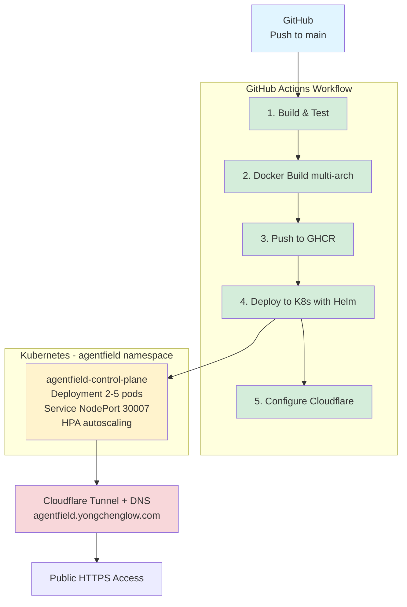

# Quick Start - Deployment Setup

This guide will help you get the GitHub Code Agent deployed to Kubernetes quickly.

## Prerequisites Checklist

- [ ] Kubernetes cluster access
- [ ] `kubectl` configured
- [ ] Helm 3.13+ installed
- [ ] Cloudflare account with tunnel
- [ ] GitHub repository with Actions enabled

## Step 1: Configure GitHub Secrets

Go to your repository **Settings → Secrets and variables → Actions** and add:

### Production Secrets

```bash
# 1. Get your kubeconfig (base64 encoded)
cat ~/.kube/config | base64 | pbcopy

# Add as: KUBECONFIG_PROD
```

### Cloudflare Secrets

Required secrets:

- `CLOUDFLARE_API_TOKEN` - API token with DNS & Tunnel edit permissions
- `CLOUDFLARE_ACCOUNT_ID` - Your Cloudflare account ID
- `CLOUDFLARE_TUNNEL_ID` - Your tunnel ID

## Step 2: Create GHCR Pull Secret in Kubernetes

```bash
# Create GitHub Personal Access Token with packages:read permission
# Then create the secret:

kubectl create secret docker-registry ghcr-secret \
  --docker-server=ghcr.io \
  --docker-username=YOUR_GITHUB_USERNAME \
  --docker-password=YOUR_GITHUB_PAT \
  --docker-email=YOUR_EMAIL \
  -n default
```

## Step 3: Update Image Repository

Edit the following files and replace `ghcr.io/yourorg/af-code-agent` with your actual repository:

1. `helm/agentfield/values.yaml` - line 4
2. `.github/workflows/staging-deploy.yml` - verify IMAGE_NAME
3. `.github/workflows/production-deploy.yml` - verify IMAGE_NAME

```bash
# Quick find and replace
REPO_NAME="your-github-org/af-code-agent"
find helm .github/workflows -type f -name "*.yaml" -o -name "*.yml" | \
  xargs sed -i '' "s|ghcr.io/yourorg/af-code-agent|ghcr.io/${REPO_NAME}|g"
```

## Step 4: Deploy

### Option A: Automatic (Recommended)

```bash
# Push to main for production deployment
git checkout main
git add .
git commit -m "feat: add deployment infrastructure"
git push origin main
```

GitHub Actions will automatically:

1. Build and test the code
2. Create Docker image
3. Push to GHCR
4. Deploy to Kubernetes
5. Configure Cloudflare

### Option B: Manual

```bash
# Build and push Docker image
docker build -t ghcr.io/YOUR_ORG/af-code-agent:v1.0.0 .
docker push ghcr.io/YOUR_ORG/af-code-agent:v1.0.0

# Deploy with Helm
helm upgrade --install agentfield-control-plane ./helm/agentfield \
  -n agentfield \
  --create-namespace \
  -f ./helm/agentfield/values-production.yaml \
  --set controlPlane.image.tag=v1.0.0 \
  --wait
```

## Step 5: Verify Deployment

```bash
# Check if pods are running
kubectl get pods -n agentfield

# Expected output:
# NAME                                         READY   STATUS    RESTARTS   AGE
# agentfield-control-plane-xxxxxxxxxx-xxxxx   1/1     Running   0          2m

# Check service
kubectl get svc -n agentfield

# View logs
kubectl logs -f deployment/agentfield-control-plane -n agentfield
```

## Step 6: Test the Deployment

```bash
# Port forward to test locally
kubectl port-forward svc/agentfield-control-plane 8001:8001 -n agentfield

# In another terminal, test the webhook endpoint
curl -X POST http://localhost:8001/webhook
```

## Step 7: Access via Public URL

After Cloudflare DNS propagates (usually 1-2 minutes):

- **Production**: https://agentfield.yongchenglow.com

## Troubleshooting

### Pods not starting?

```bash
kubectl describe pod -l app.kubernetes.io/name=agentfield -n agentfield
kubectl logs -l app.kubernetes.io/name=agentfield -n agentfield
```

### Image pull errors?

```bash
# Verify secret exists and is correct
kubectl get secret ghcr-secret -n agentfield -o yaml

# If missing, copy from default namespace
kubectl get secret ghcr-secret -n default -o yaml | \
  sed 's/namespace: default/namespace: agentfield/' | \
  kubectl apply -f -
```

### Cloudflare not working?

1. Check GitHub Actions logs for Cloudflare API errors
2. Verify tunnel is running: `cloudflared tunnel info YOUR_TUNNEL_ID`
3. Check DNS records in Cloudflare dashboard

## Next Steps

1. Configure environment variables in Helm values files
2. Set up monitoring and alerting
3. Configure horizontal pod autoscaling thresholds
4. Set up backup and disaster recovery
5. Review security settings

## Architecture



## URL

**Production**: https://agentfield.yongchenglow.com (Port: 30007)

## Support

For detailed information, see:

For detailed information, see:

- [DEPLOYMENT.md](./DEPLOYMENT.md) - Comprehensive deployment guide
- [README.md](../README.md) - Project overview and features
- [GitHub Actions](../../.github/workflows/) - Workflow files
