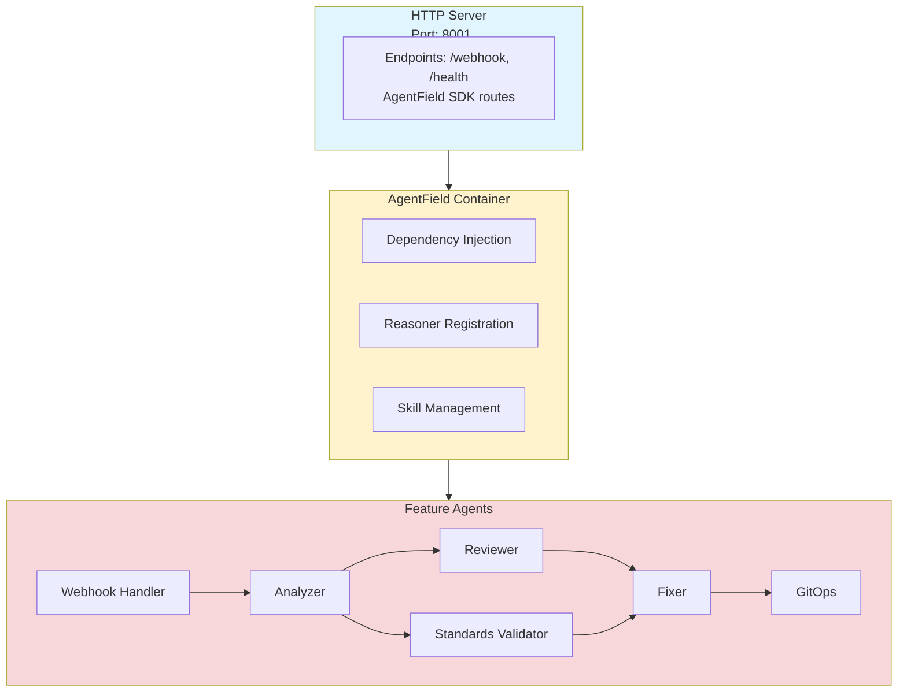

# API Reference

Technical reference for the GitHub Code Review Agent's internal architecture and APIs.

## Table of Contents

1. [Architecture Overview](#architecture-overview)
2. [Agent Reasoners](#agent-reasoners)
3. [Skills](#skills)
4. [Webhook API](#webhook-api)
5. [HTTP Endpoints](#http-endpoints)
6. [Configuration API](#configuration-api)
7. [Error Handling](#error-handling)

---

## Architecture Overview

The GitHub Code Review Agent is built using the AgentField SDK and organized into feature-based agents:



### Core Components

| Component       | Package                  | Description                          |
| --------------- | ------------------------ | ------------------------------------ |
| **Webhook**     | `agents/webhook`         | GitHub webhook handling and routing  |
| **Analyzer**    | `agents/analyzer`        | PR file analysis and metrics         |
| **Reviewer**    | `agents/reviewer`        | AI-powered code review               |
| **Standards**   | `agents/standards`       | Coding standards validation          |
| **Fixer**       | `agents/fixer`           | Fix generation with validation loop  |
| **GitOps**      | `agents/gitops`          | Git operations and GitHub API        |
| **Config**      | `pkg/config`             | Configuration management             |
| **GitHub**      | `pkg/github`             | GitHub API client                    |
| **Performance** | `pkg/performance`        | Caching, parallel execution, limits  |

---

## Agent Reasoners

Reasoners are AI-powered decision-makers registered with AgentField. Each reasoner:

- Accepts `context.Context` and `map[string]any` input
- Returns `(any, error)`
- Is registered with a unique name
- Can be invoked via AgentField SDK

### Registered Reasoners

| Reasoner Name                           | Agent            | Description                        |
| --------------------------------------- | ---------------- | ---------------------------------- |
| `webhook.handle_webhook`                | Webhook          | Process GitHub webhooks            |
| `webhook.handle_pr_opened`              | Webhook          | PR workflow orchestration          |
| `analyzer.analyze_pr`                   | Analyzer         | Analyze PR files                   |
| `reviewer.review_code`                  | Reviewer         | AI-powered code review             |
| `reviewer.detect_security_issues`       | Reviewer         | Security vulnerability detection   |
| `standards.validate_standards`          | Standards        | Coding standards validation        |
| `fixer.generate_fixes_with_validation`  | Fixer            | Generate and validate fixes        |
| `fixer.validate_fix`                    | Fixer            | Validate individual fix            |
| `gitops.create_branch`                  | GitOps           | Create Git branch                  |
| `gitops.apply_patches`                  | GitOps           | Apply code patches                 |
| `gitops.create_pull_request`            | GitOps           | Create GitHub PR                   |
| `gitops.add_review_comment`             | GitOps           | Add review comment                 |
| `gitops.update_review_comment`          | GitOps           | Update existing comment            |
| `gitops.post_review_with_fixes`         | GitOps           | Orchestrate complete workflow      |

### Example: Calling a Reasoner

```go
// Local call (same agent)
input := map[string]any{
    "owner": "yourorg",
    "repo": "yourrepo",
    "pr_number": 123,
}

result, err := app.CallLocal(ctx, "analyzer.analyze_pr", input)
if err != nil {
    return fmt.Errorf("analysis failed: %w", err)
}

// Process result
analysis := result.(*AnalysisResult)
```

---

## Skills

Skills are deterministic functions registered with AgentField. Unlike reasoners, skills don't use AI.

### Registered Skills

| Skill Name                     | Agent       | Description                      |
| ------------------------------ | ----------- | -------------------------------- |
| `webhook.validate_signature`   | Webhook     | Validate webhook signature       |
| `analyzer.parse_language`      | Analyzer    | Detect file language             |
| `analyzer.calculate_loc`       | Analyzer    | Count lines of code              |
| `fixer.apply_patch`            | Fixer       | Apply unified diff patch         |
| `standards.check_line_length`  | Standards   | Validate line length             |
| `gitops.format_commit_msg`     | GitOps      | Format commit message            |

### Example: Calling a Skill

```go
input := map[string]any{
    "file_path": "main.go",
    "content":   "package main",
}

result, err := app.CallLocal(ctx, "analyzer.parse_language", input)
if err != nil {
    return fmt.Errorf("language detection failed: %w", err)
}

language := result.(string) // "go"
```

---

## Webhook API

### Endpoint: `POST /webhook`

Processes incoming GitHub webhook events.

**Headers:**

- `X-GitHub-Event`: Event type (e.g., `pull_request`, `check_suite`)
- `X-GitHub-Delivery`: Unique delivery ID
- `X-Hub-Signature-256`: SHA256 HMAC signature
- `Content-Type`: `application/json`

**Request Body:**

```json
{
  "action": "opened",
  "number": 123,
  "pull_request": {
    "id": 123456,
    "number": 123,
    "state": "open",
    "title": "Add new feature",
    "user": {
      "login": "developer"
    },
    "head": {
      "ref": "feature-branch",
      "sha": "abc123"
    },
    "base": {
      "ref": "main",
      "sha": "def456"
    }
  },
  "repository": {
    "name": "your-repo",
    "full_name": "yourorg/your-repo",
    "owner": {
      "login": "yourorg"
    }
  },
  "installation": {
    "id": 789
  }
}
```

**Response:**

```json
{
  "success": true,
  "message": "Review workflow initiated for PR #123"
}
```

**Status Codes:**

- `200 OK`: Webhook processed successfully
- `400 Bad Request`: Invalid payload or signature
- `401 Unauthorized`: Signature validation failed
- `500 Internal Server Error`: Processing error

---

## HTTP Endpoints

### Health Check

**`GET /health`**

Returns service health status.

**Response:**

```json
{
  "status": "healthy",
  "mode": "safe"
}
```

### Webhook

**`POST /webhook`**

See [Webhook API](#webhook-api) above.

### AgentField SDK Routes

The AgentField SDK provides additional routes for:

- Agent communication
- Remote reasoner invocation
- Task orchestration

These routes are handled automatically by the AgentField handler.

---

## Configuration API

### Environment Variables

Configuration is loaded from environment variables:

```go
type EnvConfig struct {
    AgentFieldURL       string
    AgentFieldToken     string
    GitHubAppID         string
    GitHubPrivateKey    string
    GitHubWebhookSecret string
    OpenAIKey           string
    AIBaseURL           string
    AIModel             string
    LogLevel            string
    Port                string
}
```

### Configuration File

Repository-specific configuration is loaded from `.github/code-agent.yml`:

```go
type Config struct {
    Agent struct {
        Enabled bool   `yaml:"enabled"`
        Mode    string `yaml:"mode"` // "safe" or "yolo"
    } `yaml:"agent"`

    Webhooks struct {
        Triggers      []string `yaml:"triggers"`
        WaitForCI     bool     `yaml:"wait_for_ci"`
        DebounceSecs  int      `yaml:"debounce_seconds"`
    } `yaml:"webhooks"`

    Review struct {
        AutoReview        bool     `yaml:"auto_review"`
        AutoFix           bool     `yaml:"auto_fix"`
        SeverityThreshold string   `yaml:"severity_threshold"`
        IgnorePaths       []string `yaml:"ignore_paths"`
    } `yaml:"review"`

    Validation struct {
        Enabled         bool     `yaml:"enabled"`
        MaxAttempts     int      `yaml:"max_fix_attempts"`
        Checks          []string `yaml:"checks"`
        TimeoutSecs     int      `yaml:"timeout_seconds"`
    } `yaml:"validation"`
}
```

See [Configuration Reference](configuration_reference.md) for complete details.

---

## Error Handling

### Standard Errors

```go
// Webhook errors
ErrInvalidSignature   = errors.New("invalid webhook signature")
ErrUnsupportedEvent   = errors.New("unsupported event type")
ErrMissingPayload     = errors.New("missing payload data")

// GitHub API errors
ErrGitHubAPI          = errors.New("GitHub API error")
ErrRateLimit          = errors.New("rate limit exceeded")
ErrPermissionDenied   = errors.New("permission denied")
ErrInstallationNotFound = errors.New("installation not found")

// AI errors
ErrAIFailure          = errors.New("AI request failed")
ErrAITimeout          = errors.New("AI request timeout")
ErrInvalidResponse    = errors.New("invalid AI response format")

// Validation errors
ErrValidationFailed   = errors.New("validation failed")
ErrMaxAttemptsReached = errors.New("max retry attempts reached")
ErrInvalidPatch       = errors.New("invalid patch format")

// Git errors
ErrGitOperation       = errors.New("git operation failed")
ErrBranchExists       = errors.New("branch already exists")
ErrMergeConflict      = errors.New("merge conflict detected")
```

### Error Handling Pattern

```go
result, err := app.CallLocal(ctx, "review_code", input)
if err != nil {
    switch {
    case errors.Is(err, ErrRateLimit):
        // Wait and retry
        time.Sleep(time.Minute)
        result, err = app.CallLocal(ctx, "review_code", input)

    case errors.Is(err, ErrAIFailure):
        // Log and notify
        log.Errorf("AI failure: %v", err)
        notifyAdmin(err)

    default:
        // Generic error handling
        return fmt.Errorf("review failed: %w", err)
    }
}
```

---

## Performance Optimizations

### Parallel Execution

```go
import "github.com/yourorg/github-code-agent/pkg/performance"

executor := performance.NewParallelExecutor(5)

tasks := []performance.Task{
    func(ctx context.Context) (any, error) {
        return app.CallLocal(ctx, "analyze_pr", input)
    },
    func(ctx context.Context) (any, error) {
        return app.CallLocal(ctx, "validate_standards", input)
    },
}

results, err := executor.Execute(ctx, tasks)
```

### Caching

```go
import "github.com/yourorg/github-code-agent/pkg/performance"

cache := performance.NewAIResponseCache(15 * time.Minute)

// Check cache first
response, exists := cache.Get("review", prompt)
if !exists {
    // Call AI reasoner
    result, _ := app.CallLocal(ctx, "review_code", input)
    response = result["response"].(string)

    // Store in cache
    cache.Set("review", prompt, response)
}
```

### Rate Limit Handling

```go
import "github.com/yourorg/github-code-agent/pkg/performance"

limiter := performance.NewRateLimiter()

// Check rate limit before API call
if !limiter.Allow() {
    // Wait until rate limit resets
    time.Sleep(limiter.ResetTime())
}

// Make API call
result, err := ghClient.GetPullRequest(ctx, owner, repo, number)
```

---

## See Also

- [User Guide](user_guide.md) - How to use the agent
- [Configuration Reference](configuration_reference.md) - Configuration options
- [GitHub App Setup](github_app_setup.md) - Setting up GitHub App
- [AgentField Documentation](https://www.agentfield.ai) - AgentField SDK docs
