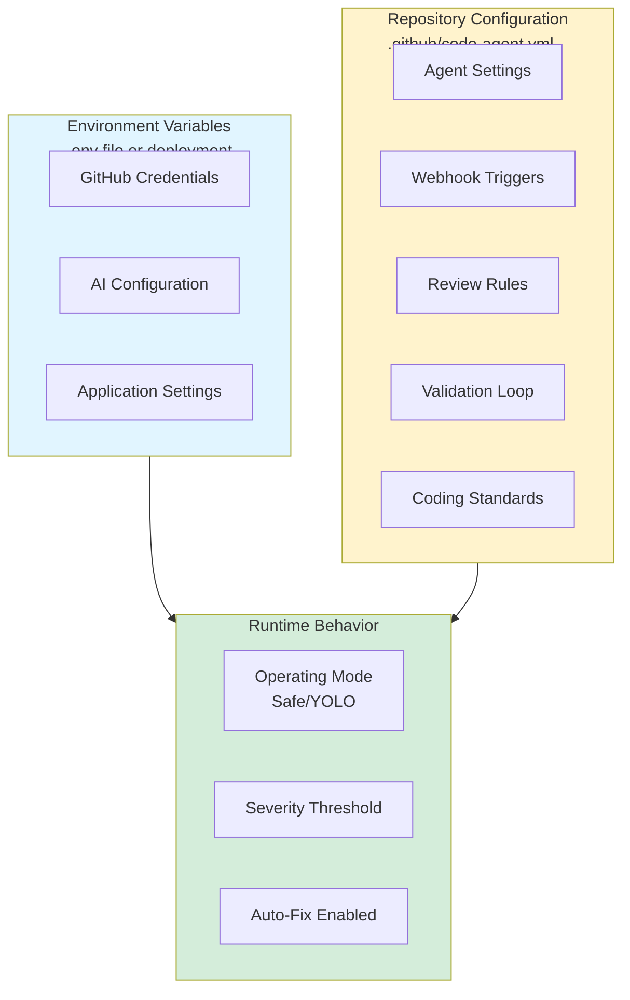

# Configuration Reference

Complete reference for all configuration options in the GitHub Code Review Agent.

## Table of Contents

1. [Environment Variables](#environment-variables)
2. [Configuration File](#configuration-file)
3. [Agent Configuration](#agent-configuration)
4. [Webhook Configuration](#webhook-configuration)
5. [Review Configuration](#review-configuration)
6. [Validation Configuration](#validation-configuration)
7. [Standards Configuration](#standards-configuration)
8. [Language-Specific Configuration](#language-specific-configuration)
9. [AI Configuration](#ai-configuration)
10. [Notification Configuration](#notification-configuration)
11. [Examples](#examples)

---

## Configuration Overview



---

## Environment Variables

Environment variables are defined in `.env` file or set in your deployment environment.

### GitHub Configuration

| Variable                  | Required | Description                                | Example            |
| ------------------------- | -------- | ------------------------------------------ | ------------------ |
| `GITHUB_APP_ID`           | Yes      | GitHub App ID                              | `123456`           |
| `GITHUB_PRIVATE_KEY`      | Yes      | GitHub App private key (PEM format)        | `-----BEGIN...`    |
| `GITHUB_WEBHOOK_SECRET`   | Yes      | Webhook secret for signature validation    | `your-secret-here` |

### AI Configuration

| Variable             | Required | Description                                | Default                  | Example                    |
| -------------------- | -------- | ------------------------------------------ | ------------------------ | -------------------------- |
| `OPENAI_API_KEY`     | Yes      | API key for DeepSeek or OpenAI-compatible  | -                        | `sk-abc123`                |
| `AI_MODEL`           | Yes      | AI model to use                            | `deepseek-chat`          | `gpt-4o`                   |
| `AI_BASE_URL`        | No       | Custom AI API base URL                     | Auto-detected            | `https://api.deepseek.com` |
| `AI_TEMPERATURE`     | No       | AI temperature (0-1)                       | `0.2`                    | `0.1`                      |
| `AI_MAX_TOKENS`      | No       | Maximum tokens per request                 | `4000`                   | `2000`                     |

### AgentField Configuration

| Variable         | Required | Description                  | Default                 | Example                             |
| ---------------- | -------- | ---------------------------- | ----------------------- | ----------------------------------- |
| `AGENTFIELD_URL` | No       | AgentField control plane URL | `http://localhost:8001` | `https://agentfield.yourdomain.com` |
| `AGENTFIELD_TOKEN` | No     | AgentField authentication token | -                     | `your-token-here`                   |

### Application Configuration

| Variable    | Required | Description      | Default | Example                  |
| ----------- | -------- | ---------------- | ------- | ------------------------ |
| `LOG_LEVEL` | No       | Logging level    | `info`  | `debug`, `warn`, `error` |
| `PORT`      | No       | HTTP server port | `8001`  | `3000`, `8080`           |

---

## Configuration File

Configuration file is located at `.github/code-agent.yml` in your repository.

### Basic Structure

```yaml
agent:
  # Agent settings

webhooks:
  # Webhook triggers

review:
  # Review settings

validation:
  # Validation settings

standards:
  # Coding standards

languages:
  # Language-specific settings

ai:
  # AI model configuration

notifications:
  # Notification settings
```

---

## Agent Configuration

Top-level agent settings.

### Schema

```yaml
agent:
  enabled: boolean
  mode: string
```

### Properties

#### `enabled`

- **Type**: `boolean`
- **Required**: Yes
- **Default**: `true`
- **Description**: Enable/disable the agent for this repository
- **Example**:
  ```yaml
  agent:
    enabled: false # Temporarily disable agent
  ```

#### `mode`

- **Type**: `string`
- **Required**: Yes
- **Default**: `safe`
- **Allowed values**: `safe`, `yolo`
- **Description**: Operating mode for the agent
  - `safe`: Create PR with fixes for manual review
  - `yolo`: Push fixes directly to PR branch
- **Example**:
  ```yaml
  agent:
    mode: yolo # Push fixes directly
  ```

---

## Webhook Configuration

Controls which GitHub events trigger the agent.

### Schema

```yaml
webhooks:
  triggers: array
  wait_for_ci: boolean
  debounce_seconds: number
```

### Properties

#### `triggers`

- **Type**: `array` of strings
- **Required**: Yes
- **Default**: `[pull_request.opened, pull_request.synchronize]`
- **Description**: GitHub webhook events that trigger reviews
- **Allowed values**:
  - `pull_request.opened`
  - `pull_request.synchronize`
  - `pull_request.reopened`
  - `check_suite.completed`
  - `workflow_run.completed`
- **Example**:
  ```yaml
  webhooks:
    triggers:
      - pull_request.opened
      - check_suite.completed # Wait for CI/CD
  ```

#### `wait_for_ci`

- **Type**: `boolean`
- **Required**: No
- **Default**: `false`
- **Description**: Wait for CI/CD pipeline to complete before reviewing
- **Example**:
  ```yaml
  webhooks:
    wait_for_ci: true # Review only after tests pass/fail
  ```

#### `debounce_seconds`

- **Type**: `number`
- **Required**: No
- **Default**: `0`
- **Min**: `0`
- **Max**: `300`
- **Description**: Wait time (seconds) to group rapid commits before reviewing
- **Example**:
  ```yaml
  webhooks:
    debounce_seconds: 30 # Wait 30s for more commits
  ```

---

## Review Configuration

Controls code review behavior.

### Schema

```yaml
review:
  auto_review: boolean
  auto_fix: boolean
  severity_threshold: string
  ignore_paths: array
  max_files: number
  max_loc: number
```

### Properties

#### `auto_review`

- **Type**: `boolean`
- **Required**: No
- **Default**: `true`
- **Description**: Automatically review PRs
- **Example**:
  ```yaml
  review:
    auto_review: false # Require manual trigger
  ```

#### `auto_fix`

- **Type**: `boolean`
- **Required**: No
- **Default**: `true`
- **Description**: Automatically generate and apply fixes
- **Example**:
  ```yaml
  review:
    auto_fix: false # Review only, no fixes
  ```

#### `severity_threshold`

- **Type**: `string`
- **Required**: No
- **Default**: `medium`
- **Allowed values**: `critical`, `high`, `medium`, `low`
- **Description**: Only auto-fix issues at or below this severity level
- **Example**:
  ```yaml
  review:
    severity_threshold: low # Only auto-fix Low severity issues
  ```

#### `ignore_paths`

- **Type**: `array` of strings (glob patterns)
- **Required**: No
- **Default**: `[]`
- **Description**: File patterns to exclude from review
- **Example**:
  ```yaml
  review:
    ignore_paths:
      - "*.md"
      - "docs/**"
      - "vendor/**"
      - "node_modules/**"
      - "*.test.js"
      - "**/*_test.go"
  ```

#### `max_files`

- **Type**: `number`
- **Required**: No
- **Default**: `50`
- **Description**: Maximum number of files to review per PR
- **Example**:
  ```yaml
  review:
    max_files: 100 # Review larger PRs
  ```

#### `max_loc`

- **Type**: `number`
- **Required**: No
- **Default**: `400`
- **Description**: Maximum lines of code to review per PR
- **Example**:
  ```yaml
  review:
    max_loc: 1000 # Review larger changes
  ```

---

## Validation Configuration

Controls fix validation loop.

### Schema

```yaml
validation:
  enabled: boolean
  max_fix_attempts: number
  checks: array
  timeout_seconds: number
  auto_format: boolean
```

### Properties

#### `enabled`

- **Type**: `boolean`
- **Required**: No
- **Default**: `true`
- **Description**: Enable validation of generated fixes
- **Example**:
  ```yaml
  validation:
    enabled: false # Skip validation (not recommended)
  ```

#### `max_fix_attempts`

- **Type**: `number`
- **Required**: No
- **Default**: `3`
- **Min**: `1`
- **Max**: `10`
- **Description**: Maximum retry attempts per fix before giving up
- **Example**:
  ```yaml
  validation:
    max_fix_attempts: 5 # Try harder to fix issues
  ```

#### `checks`

- **Type**: `array` of strings
- **Required**: No
- **Default**: `[syntax, linting, formatting, security]`
- **Allowed values**: `syntax`, `linting`, `formatting`, `security`, `tests`
- **Description**: Validation checks to run on fixes
- **Example**:
  ```yaml
  validation:
    checks:
      - syntax
      - linting
      - security # Skip formatting check
  ```

#### `timeout_seconds`

- **Type**: `number`
- **Required**: No
- **Default**: `30`
- **Min**: `5`
- **Max**: `300`
- **Description**: Timeout for each validation attempt
- **Example**:
  ```yaml
  validation:
    timeout_seconds: 60 # Allow more time for slow linters
  ```

#### `auto_format`

- **Type**: `boolean`
- **Required**: No
- **Default**: `true`
- **Description**: Automatically format code before validation
- **Example**:
  ```yaml
  validation:
    auto_format: false # Don't auto-format
  ```

---

## Standards Configuration

Defines coding standards and rules.

### Schema

```yaml
standards:
  coding:
    max_line_length: number
    max_function_length: number
    max_complexity: number
    naming_conventions:
      functions: string
      classes: string
      constants: string

  documentation:
    require_docstrings: boolean
    docstring_style: string
    require_type_hints: boolean
    require_module_docs: boolean

  security:
    check_dependencies: boolean
    check_secrets: boolean
    owasp_checks: boolean
```

### Coding Standards

#### `max_line_length`

- **Type**: `number`
- **Default**: `100`
- **Range**: `80-200`
- **Description**: Maximum characters per line
- **Example**: `120`

#### `max_function_length`

- **Type**: `number`
- **Default**: `50`
- **Range**: `10-200`
- **Description**: Maximum lines per function
- **Example**: `100`

#### `max_complexity`

- **Type**: `number`
- **Default**: `10`
- **Range**: `1-50`
- **Description**: Maximum cyclomatic complexity
- **Example**: `15`

#### `naming_conventions`

- **Type**: `object`
- **Properties**:
  - `functions`: `snake_case`, `camelCase`, `PascalCase`
  - `classes`: `PascalCase`, `snake_case`
  - `constants`: `UPPER_SNAKE_CASE`, `camelCase`
- **Example**:
  ```yaml
  naming_conventions:
    functions: camelCase
    classes: PascalCase
    constants: UPPER_SNAKE_CASE
  ```

### Documentation Standards

#### `require_docstrings`

- **Type**: `boolean`
- **Default**: `true`
- **Description**: Require docstrings/comments on functions
- **Example**: `false`

#### `docstring_style`

- **Type**: `string`
- **Default**: `google`
- **Allowed values**: `google`, `numpy`, `sphinx`, `jsdoc`
- **Description**: Docstring format style
- **Example**: `numpy`

#### `require_type_hints`

- **Type**: `boolean`
- **Default**: `true`
- **Description**: Require type hints/annotations
- **Example**: `false`

#### `require_module_docs`

- **Type**: `boolean`
- **Default**: `true`
- **Description**: Require module-level documentation
- **Example**: `false`

### Security Standards

#### `check_dependencies`

- **Type**: `boolean`
- **Default**: `true`
- **Description**: Check for vulnerable dependencies
- **Example**: `false`

#### `check_secrets`

- **Type**: `boolean`
- **Default**: `true`
- **Description**: Detect hardcoded secrets/credentials
- **Example**: `true`

#### `owasp_checks`

- **Type**: `boolean`
- **Default**: `true`
- **Description**: Check for OWASP Top 10 vulnerabilities
- **Example**: `true`

---

## Language-Specific Configuration

Customize settings per programming language.

### Schema

```yaml
languages:
  <language>:
    linters: array
    min_test_coverage: number
    complexity_threshold: number
    frameworks: array
```

### Supported Languages

- `go`
- `python`
- `javascript`
- `typescript`
- `java`
- `ruby`
- `php`
- `rust`

### Properties

#### `linters`

- **Type**: `array` of strings
- **Description**: Linters to run for this language
- **Examples**:

  ```yaml
  languages:
    python:
      linters:
        - pylint
        - black
        - mypy

    javascript:
      linters:
        - eslint
        - prettier

    go:
      linters:
        - golangci-lint
  ```

#### `min_test_coverage`

- **Type**: `number`
- **Default**: `0` (not enforced)
- **Range**: `0-100`
- **Description**: Minimum test coverage percentage
- **Example**: `80`

#### `complexity_threshold`

- **Type**: `number`
- **Default**: Uses global `max_complexity`
- **Description**: Override complexity threshold for this language
- **Example**: `15`

#### `frameworks`

- **Type**: `array` of strings
- **Description**: Frameworks used (helps with context-aware analysis)
- **Examples**:

  ```yaml
  languages:
    javascript:
      frameworks:
        - react
        - express

    python:
      frameworks:
        - django
        - flask
  ```

---

## AI Configuration

AI model and behavior settings.

### Schema

```yaml
ai:
  provider: string
  model: string
  base_url: string
  temperature: number
  max_tokens: number
```

### Properties

#### `provider`

- **Type**: `string`
- **Default**: `deepseek`
- **Allowed values**: `deepseek`, `openai`, `anthropic`, `custom`
- **Description**: AI provider
- **Example**: `openai`

#### `model`

- **Type**: `string`
- **Default**: `deepseek-chat`
- **Description**: Model identifier
- **Examples**:
  - `deepseek-chat`
  - `gpt-4o`
  - `claude-opus-4-5`
  - `codellama`

#### `base_url`

- **Type**: `string`
- **Required**: No
- **Description**: Custom API base URL
- **Example**: `https://api.deepseek.com`

#### `temperature`

- **Type**: `number`
- **Default**: `0.2`
- **Range**: `0.0-1.0`
- **Description**: AI temperature (creativity vs consistency)
  - Lower (0.1): More deterministic, consistent
  - Higher (0.8): More creative, varied
- **Example**: `0.1`

#### `max_tokens`

- **Type**: `number`
- **Default**: `4000`
- **Range**: `100-32000`
- **Description**: Maximum tokens per AI request
- **Example**: `2000`

---

## Notification Configuration

Control notifications and comments.

### Schema

```yaml
notifications:
  on_review_complete: boolean
  on_fixes_applied: boolean
  mention_author: boolean
  comment_style: string
```

### Properties

#### `on_review_complete`

- **Type**: `boolean`
- **Default**: `true`
- **Description**: Post summary comment when review completes
- **Example**: `false`

#### `on_fixes_applied`

- **Type**: `boolean`
- **Default**: `true`
- **Description**: Post comment when fixes are applied
- **Example**: `true`

#### `mention_author`

- **Type**: `boolean`
- **Default**: `false`
- **Description**: @mention PR author in comments
- **Example**: `true`

#### `comment_style`

- **Type**: `string`
- **Default**: `detailed`
- **Allowed values**: `minimal`, `standard`, `detailed`
- **Description**: Comment verbosity level
- **Example**: `standard`

---

## Examples

### Minimal Configuration

```yaml
agent:
  enabled: true
  mode: safe

review:
  auto_review: true
  auto_fix: true
```

### Production Configuration

```yaml
agent:
  enabled: true
  mode: safe

webhooks:
  triggers:
    - pull_request.opened
    - check_suite.completed
  wait_for_ci: true
  debounce_seconds: 30

review:
  auto_review: true
  auto_fix: true
  severity_threshold: medium
  ignore_paths:
    - "vendor/**"
    - "node_modules/**"
    - "*.test.js"
  max_files: 50
  max_loc: 400

validation:
  enabled: true
  max_fix_attempts: 3
  checks:
    - syntax
    - linting
    - formatting
    - security
  timeout_seconds: 30

standards:
  coding:
    max_line_length: 100
    max_function_length: 50
    max_complexity: 10
  documentation:
    require_docstrings: true
    docstring_style: google
  security:
    check_secrets: true
    owasp_checks: true

languages:
  go:
    linters:
      - golangci-lint
    min_test_coverage: 75
  python:
    linters:
      - pylint
      - black
    min_test_coverage: 80
```

### Aggressive Auto-Fix (YOLO)

```yaml
agent:
  enabled: true
  mode: yolo

review:
  auto_review: true
  auto_fix: true
  severity_threshold: high # Auto-fix up to High severity

validation:
  max_fix_attempts: 5 # Try harder

notifications:
  mention_author: true # Notify author immediately
```

### Review-Only Mode

```yaml
agent:
  enabled: true
  mode: safe

review:
  auto_review: true
  auto_fix: false # Review only, no fixes

notifications:
  on_review_complete: true
  comment_style: detailed
```

---

## Validation

The agent validates configuration on startup. Common validation errors:

- Invalid `mode` value → must be `safe` or `yolo`
- Invalid `severity_threshold` → must be `critical`, `high`, `medium`, or `low`
- `max_fix_attempts` < 1 → must be at least 1
- Invalid webhook trigger → must be recognized GitHub event
- Invalid linter name → check language-specific linter availability

---

## Configuration Precedence

Configuration is loaded in this order (later overrides earlier):

1. Default values
2. `.github/code-agent.yml` (repository)
3. Environment variables (for secrets)
4. PR labels (for per-PR overrides)

Example:

```yaml
# Default: mode = safe
# .github/code-agent.yml: mode = yolo
# PR label: agent:safe
# Final: mode = safe (PR label wins)
```

---

## See Also

- [User Guide](user_guide.md) - How to use the agent
- [API Reference](api_reference.md) - Technical API documentation
- [GitHub App Setup](github_app_setup.md) - Setting up GitHub App
- [Deployment](deployment.md) - Deployment instructions
