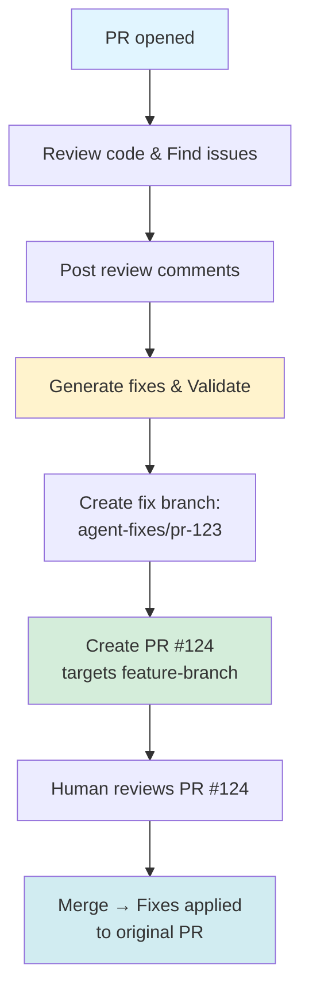
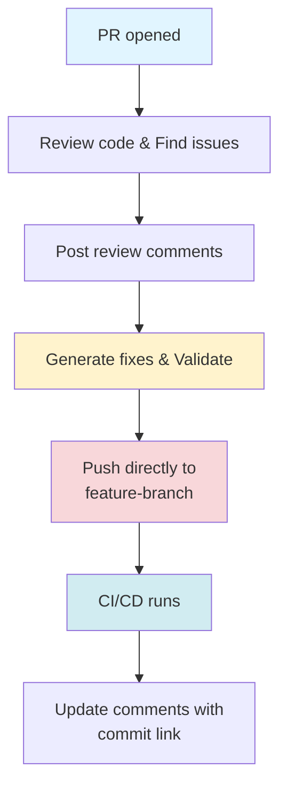

# GitHub Code Review Agent - User Guide

## Table of Contents

1. [Introduction](#introduction)
2. [Getting Started](#getting-started)
3. [Operating Modes](#operating-modes)
4. [Using the Agent](#using-the-agent)
5. [Language Support](#language-support)
6. [Troubleshooting](#troubleshooting)
7. [Best Practices](#best-practices)
8. [FAQ](#faq)

## Introduction

The GitHub Code Review Agent is an autonomous AI-powered code reviewer that automatically:

- Reviews pull requests when they're opened or updated
- Identifies bugs, security vulnerabilities, and code smells
- Validates code against configurable standards
- Generates and applies fixes automatically
- Posts detailed review comments with severity levels

**Key Features:**

- 🤖 **Automated Reviews**: AI-powered code analysis using DeepSeek
- 🔒 **Security Scanning**: OWASP Top 10 vulnerability detection
- 📝 **Standards Validation**: Enforces coding standards and best practices
- 🔧 **Auto-Fix**: Generates and applies fixes with validation loop
- 🎯 **Smart Prioritization**: Issues categorized by severity (Critical, High, Medium, Low)
- 🔄 **Two Modes**: Safe (PR with fixes) and YOLO (direct push)

## Getting Started

### Quick Setup

1. **Clone and build:**

   ```bash
   git clone <repository-url>
   cd github-code-agent
   go build -o github-code-agent ./cmd/agent
   ```

2. **Configure environment:**

   ```bash
   cp .env.example .env
   # Edit .env with your credentials
   ```

3. **Set up GitHub App:**

   See [GitHub App Setup Guide](github_app_setup.md) for detailed instructions.

4. **Configure repository:**

   Create `.github/code-agent.yml` in your repository (see [Configuration Reference](configuration_reference.md)).

### First PR Review

1. **Create a test PR** with some code changes
2. **Push your branch**: `git push origin feature-branch`
3. **Open a PR** on GitHub
4. **Watch the agent work**:
   - Posts initial acknowledgment comment
   - Analyzes code and runs validations
   - Posts review comments with issues found
   - Generates and applies fixes (if enabled)
   - Updates comments with fix links

### Understanding Review Comments

The agent posts comments with severity indicators:

```
🔴 Critical: Potential nil pointer dereference

Details:
The function `main` doesn't check if `user` is nil before accessing
the `Name` field, which will cause a panic.

Suggested fix:
Add nil check: if user != nil { ... }

Automated review by GitHub Code Agent
```

**Severity Levels:**

| Emoji | Severity | Auto-Fix           | Examples                                     |
| ----- | -------- | ------------------ | -------------------------------------------- |
| 🔴    | Critical | ✓ (Safe mode only) | Security vulnerabilities, breaking changes   |
| 🟠    | High     | ✓                  | Bugs, performance issues, major code smells  |
| 🟡    | Medium   | ✓                  | Maintainability concerns, minor improvements |
| 🔵    | Low      | ✓                  | Style issues, documentation improvements     |

## Operating Modes

### Safe Mode (Recommended)

**What it does:**

- Creates a new branch with fixes
- Opens a PR targeting your original PR branch
- Allows human review before merging
- Safer for production repositories

**When to use:**

- Production repositories
- Teams new to the agent
- Complex changes requiring review
- High-stakes code

**Configuration:**

```yaml
agent:
  mode: safe
```

**Workflow:**



### YOLO Mode

**What it does:**

- Pushes fixes directly to your PR branch
- No intermediate PR created
- Faster, but more aggressive

**When to use:**

- Personal repositories
- Trusted, well-tested code
- Simple, low-risk fixes
- Development/staging environments

**Configuration:**

```yaml
agent:
  mode: yolo
  review:
    require_tests_passing: true # Safety check
```

**Workflow:**



### Controlling Modes Per-PR

Override the default mode using PR labels:

- `agent:safe` - Force safe mode
- `agent:yolo` - Force YOLO mode
- `agent:skip` - Skip automated review
- `agent:review-only` - Review but don't auto-fix

## Using the Agent

### Review-Only Mode

Disable auto-fix and only get review comments:

```yaml
review:
  auto_fix: false
```

### Configuring Severity Threshold

Only auto-fix issues at or below a certain severity:

```yaml
review:
  severity_threshold: low # Only auto-fix Low severity issues
```

### Excluding Files from Review

Skip generated files, tests, or documentation:

```yaml
review:
  ignore_paths:
    - "*.md"
    - "docs/**"
    - "vendor/**"
    - "node_modules/**"
    - "*.test.js"
    - "**/*_test.go"
```

### Waiting for CI/CD

Let tests pass before reviewing:

```yaml
webhooks:
  wait_for_ci: true
  triggers:
    - pull_request.opened
    - check_suite.completed
```

### Validation Loop

The agent validates fixes before applying them:

```yaml
validation:
  enabled: true
  max_fix_attempts: 3
  checks:
    - syntax
    - linting
    - formatting
    - security
  timeout_seconds: 30
```

Each fix attempt goes through:

1. Syntax checking (language-specific parsers)
2. Linting (golangci-lint, flake8, eslint)
3. Formatting (gofmt, black, prettier)
4. Security scanning
5. Issue verification

If validation fails, the agent retries (up to `max_fix_attempts` times).

## Language Support

### Supported Languages

The agent supports the following languages with full analysis:

#### Go

- **Linters**: golangci-lint
- **Formatters**: gofmt
- **Metrics**: cyclomatic complexity, LOC
- **Security**: hardcoded secrets, SQL injection, unsafe operations

#### Python

- **Linters**: pylint, black, mypy, flake8
- **Formatters**: black, autopep8
- **Metrics**: complexity, test coverage
- **Security**: injection attacks, secrets, insecure dependencies

#### JavaScript/TypeScript

- **Linters**: eslint, prettier
- **Frameworks**: React, Vue, Angular detection
- **Security**: XSS, prototype pollution, dependency vulnerabilities

#### Other Languages (Basic Support)

- Java
- Ruby
- PHP
- C/C++
- Rust

### Language-Specific Configuration

```yaml
languages:
  go:
    linters:
      - golangci-lint
    min_test_coverage: 75
    complexity_threshold: 10

  python:
    linters:
      - pylint
      - black
      - mypy
    min_test_coverage: 80
    docstring_style: google

  javascript:
    linters:
      - eslint
      - prettier
    frameworks:
      - react
    min_test_coverage: 70
```

## Troubleshooting

### Agent Not Responding

**Problem**: Agent doesn't comment on PRs

**Solutions:**

1. **Check webhook delivery:**
   - Go to GitHub App → Advanced → Recent Deliveries
   - Verify webhooks are being sent successfully

2. **Check agent logs:**

   ```bash
   docker logs github-code-agent
   # or
   kubectl logs -f deployment/agentfield-control-plane -n agentfield
   ```

3. **Verify configuration:**
   - Ensure `.github/code-agent.yml` exists
   - Check `agent.enabled: true`

4. **Check webhook URL:**
   - Verify it's publicly accessible
   - Test with `curl https://your-domain.com/webhook`

### Fixes Not Being Applied

**Problem**: Agent reviews but doesn't create fixes

**Solutions:**

1. **Check auto-fix setting:**

   ```yaml
   review:
     auto_fix: true # Ensure this is enabled
   ```

2. **Check severity threshold:**

   ```yaml
   review:
     severity_threshold: medium # Only fixes medium and below
   ```

3. **Check validation logs:**
   - Fixes may be failing validation
   - Check logs for syntax/lint errors

4. **Increase max attempts:**
   ```yaml
   validation:
     max_fix_attempts: 5 # Default is 3
   ```

### High API Costs

**Problem**: DeepSeek API costs are higher than expected

**Solutions:**

1. **Enable caching:**
   - Caching is enabled by default (15-min TTL)
   - Check cache hit rate in logs

2. **Reduce review frequency:**

   ```yaml
   webhooks:
     wait_for_ci: true # Wait for CI before reviewing
     debounce_seconds: 60 # Wait longer for rapid commits
   ```

3. **Limit file scope:**

   ```yaml
   review:
     ignore_paths:
       - "vendor/**"
       - "node_modules/**"
       - "*.test.js"
   ```

4. **Lower temperature:**
   ```bash
   AI_TEMPERATURE=0.1  # More deterministic, uses less tokens
   ```

### Permission Errors

**Problem**: "403 Forbidden" or "Resource not accessible"

**Solutions:**

1. **Check GitHub App permissions:**
   - Contents: Read & Write
   - Pull requests: Read & Write
   - Checks: Read

2. **Reinstall the app:**
   - Go to GitHub Settings → Applications
   - Uninstall and reinstall the agent

3. **Verify private key:**
   - Ensure `.pem` file is correct
   - Check file permissions: `chmod 600 private-key.pem`

## Best Practices

### 1. Start with Safe Mode

Begin with Safe mode to understand how the agent works:

```yaml
agent:
  mode: safe
```

Once comfortable, consider YOLO mode for specific repositories.

### 2. Configure Severity Thresholds

Only auto-fix low-risk issues:

```yaml
review:
  severity_threshold: low # Only auto-fix Low severity issues
```

Critical/High issues should be reviewed manually.

### 3. Wait for CI/CD

Let tests pass before reviewing:

```yaml
webhooks:
  wait_for_ci: true
  triggers:
    - check_suite.completed
```

This avoids reviewing code that fails tests.

### 4. Use Ignore Paths

Exclude generated files, dependencies:

```yaml
review:
  ignore_paths:
    - "vendor/**"
    - "node_modules/**"
    - "*.pb.go" # Protocol buffer generated files
    - "docs/**"
```

### 5. Monitor and Adjust

Review agent performance regularly:

- Check fix acceptance rate
- Monitor API costs
- Adjust standards as needed
- Collect team feedback

### 6. Gradual Rollout

1. **Week 1**: Enable on 1-2 test repositories
2. **Week 2**: Review-only mode on more repos
3. **Week 3**: Safe mode with auto-fix
4. **Week 4+**: Consider YOLO mode for select repos

## FAQ

### How much does it cost to run?

**AI Costs (DeepSeek via OpenRouter):**

- ~$20-35/month for 50 PRs/day
- 85-90% cheaper than GPT-4 or Claude

**Infrastructure:**

- $50-100/month for cloud VMs (2-4 Go agent pods)

**Total: ~$80-135/month**

### Is my code sent to third parties?

- PR content is sent to DeepSeek API for analysis
- All data is transmitted over HTTPS
- DeepSeek doesn't store prompts (check their policy)
- Consider self-hosted AI for sensitive code

### Can I use a different AI model?

Yes! The agent supports any OpenAI-compatible API:

```bash
# OpenAI
OPENAI_API_KEY=sk-proj-...
AI_MODEL=gpt-4o

# Anthropic Claude (via OpenRouter)
OPENROUTER_API_KEY=sk-or-v1-...
AI_MODEL=anthropic/claude-opus-4-5

# Self-hosted (e.g., Ollama)
AI_BASE_URL=http://localhost:11434/v1
AI_MODEL=codellama
```

### How do I disable the agent for a specific PR?

Add the `agent:skip` label to the PR.

### Can it review draft PRs?

Yes, configure webhook triggers:

```yaml
webhooks:
  triggers:
    - pull_request.opened
    - pull_request.ready_for_review # Or wait until draft → ready
```

### What if the agent makes a mistake?

1. **Reject the fix PR** (Safe mode) or **revert the commit** (YOLO mode)
2. **Add feedback** as a PR comment (future enhancement: learning from feedback)
3. **Adjust configuration** to prevent similar issues

### Can it work with monorepos?

Yes! Configure per-directory:

```yaml
# .github/code-agent.yml
review:
  ignore_paths:
    - "service-a/**" # Exclude specific services

# service-b/.code-agent.yml (override)
standards:
  coding:
    max_line_length: 120  # Different standard for this service
```

### How do I update the agent?

```bash
git pull origin main
go build -o github-code-agent ./cmd/agent
docker restart github-code-agent
```

For major updates, review the CHANGELOG for breaking changes.

---

## Getting Help

- **Issues**: <https://github.com/yongchenglow/af-code-agent/issues>
- **Discussions**: <https://github.com/yongchenglow/af-code-agent/discussions>
- **Documentation**: See `docs/` directory
- **AgentField**: <https://www.agentfield.ai>

## Contributing

We welcome contributions! See [CONTRIBUTING.md](../CONTRIBUTING.md) for guidelines.

## License

MIT License - see [LICENSE](../LICENSE) for details.
